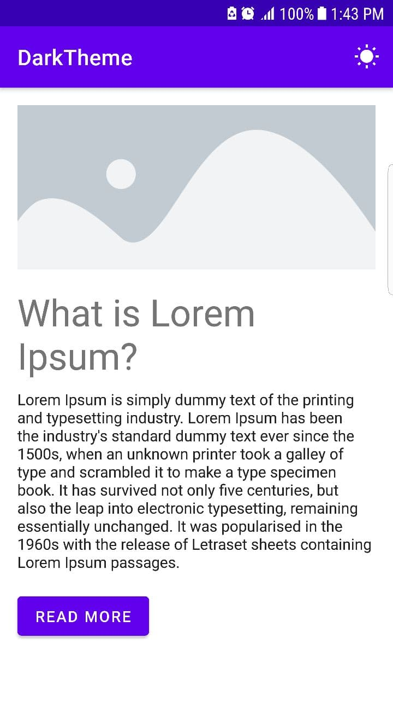
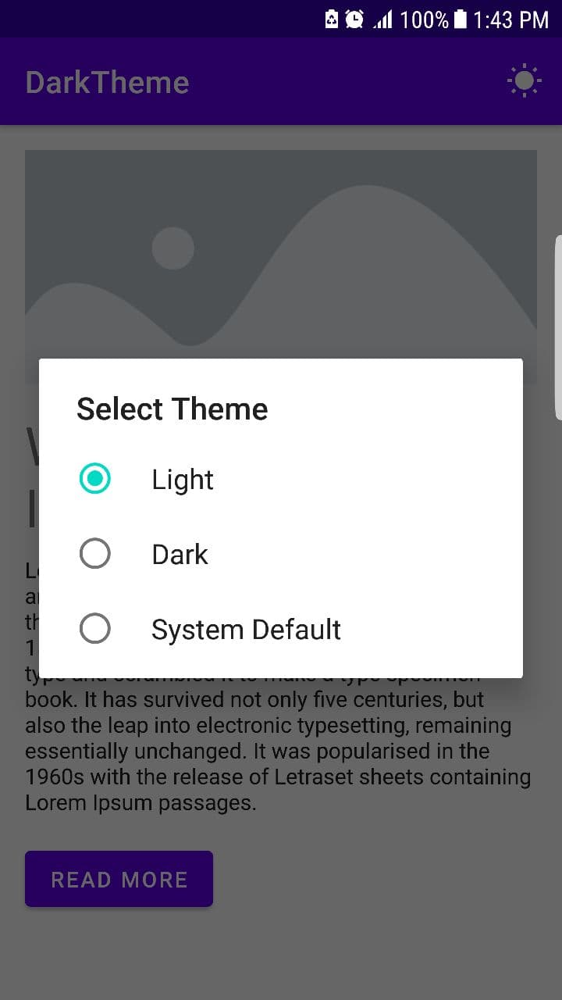
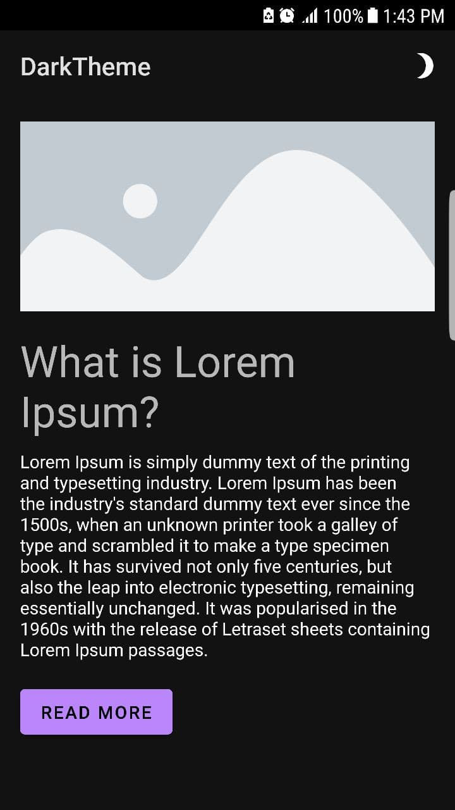

# Dark-Theme-Kotlin
* Dark Mode on Android App with Kotlin

# Screenshots

<table border="0">
    <tr>
        <td></td>
        <td></td>
        <td></td>
    </tr>
</table>

<!--## Features

* [X] Persistent
* [X] z

## Contributors
- **joel-->
